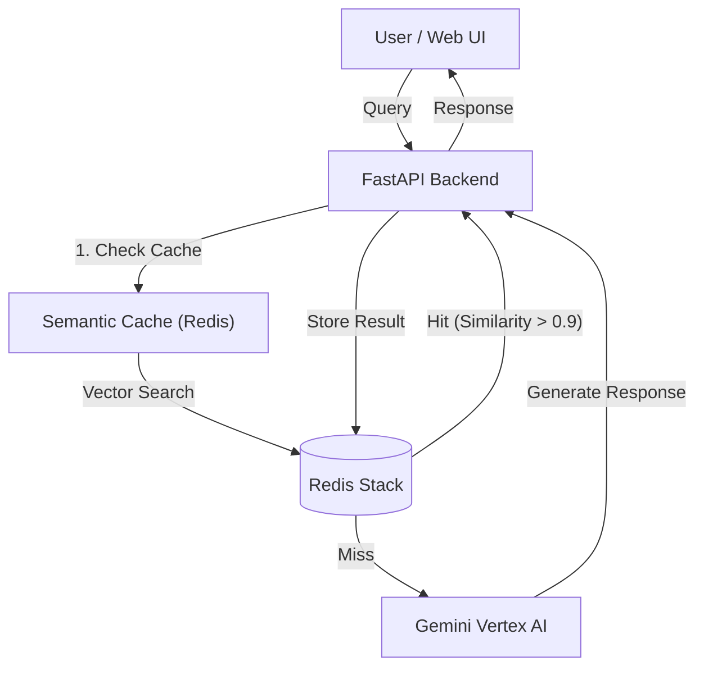

# 🧠 Semantic Cache with Redis & Gemini Vertex AI


A production-ready **Semantic Caching** system built with **Redis Stack** (Vector Search) and **Google Gemini Vertex AI**. This project demonstrates how to significantly reduce LLM costs and latency by caching responses based on *semantic meaning* rather than exact text matching.

Includes a premium, dark-themed **Web Interface** to visualize cache hits, misses, and similarity scores in real-time.

---

## ✨ Key Features

- **🚀 Semantic Caching**: Uses vector embeddings to understand the *intent* of a query.
    - *Example*: "Tell me the capital of France" matches "What is the capital of France?"
- **⚡ High Performance**:
    - **Cache Hit**: ~0.2s (Redis Vector Search)
    - **Cache Miss**: ~1.5s+ (LLM Generation)
- **🧠 Advanced AI Models**:
    - **Embeddings**: `gemini-embedding-001` (3072 dimensions) for high-fidelity semantic understanding.
    - **Generation**: `gemini-2.5-flash` for fast, accurate responses.
- **🎨 Premium Web UI**:
    - Real-time latency visualization.
    - Visual indicators for Cache Hits (Green) vs Misses (Blue).
    - Dashboard to inspect and manage cached entries.
- **🛠️ Production Ready**:
    - Dockerized Redis Stack.
    - Environment-based configuration (`.env`).
    - FastAPI backend with REST endpoints.
- **🤖 LangGraph Agent**:
    - Integrated **LangGraph** agent with **Gemini Web Search** (Grounding).
    - Provides real-time, grounded answers with citations.

---

## 🏗️ Architecture



---

## 🚀 Getting Started

### Prerequisites

- **Python 3.9+**
- **Docker** (for Redis Stack)
- **Google Cloud Project** with Vertex AI API enabled.
- **Service Account Key** (`gemini-api-key.json`) with Vertex AI User permissions.

### 1. Clone the Repository

```bash
git clone https://github.com/yourusername/semantic-cache-redis.git
cd semantic-cache-redis
```

### 2. Start Redis Stack

Run Redis with RediSearch and RedisJSON modules using Docker:

```bash
docker run -d --name redis-stack -p 6379:6379 -p 8001:8001 redis/redis-stack:latest
```

### 3. Environment Setup

Create a virtual environment and install dependencies:

```bash
python3 -m venv venv
source venv/bin/activate
pip install -r requirements.txt
```

### 4. Configuration

Create a `.env` file in the root directory:

```ini
# Redis
REDIS_HOST=localhost
REDIS_PORT=6379
REDIS_PASSWORD=

# Google Cloud
GOOGLE_APPLICATION_CREDENTIALS=gemini-api-key.json
PROJECT_ID=your-project-id
LOCATION=us-central1

# Models
EMBEDDING_MODEL_ID=gemini-embedding-001
GENERATION_MODEL_ID=gemini-2.5-flash

# Cache Settings
SIMILARITY_THRESHOLD=0.9
CACHE_TTL_SECONDS=3600
VECTOR_DIMENSION=3072
INDEX_NAME=semantic_cache_idx
```

> **Note**: Ensure `VECTOR_DIMENSION` matches your embedding model (3072 for `gemini-embedding-001`).

---

## 🖥️ Usage

### Running the Web Interface

Start the FastAPI server:

```bash
uvicorn app:app --reload
```

Open your browser and navigate to:
👉 **http://localhost:8000/static/index.html**

### Using the UI

1.  **Ask a Question**: Type a query like "What is the capital of France?".
    - *Result*: **Cache MISS** (Blue badge). The system calls Gemini.
2.  **Ask Again**: Type the same question or a variation like "Tell me the capital city of France".
    - *Result*: **Cache HIT** (Green badge). The system finds the semantic match in Redis.
3.  **Check Dashboard**: Scroll down to see stored cache entries.

### API Endpoints

- `POST /ask`: Submit a query.
- `POST /agent/ask`: Ask the LangGraph agent (with Google Search).
- `GET /cache`: Retrieve all cached entries.
- `DELETE /cache`: Clear the cache.

---

## 🧪 Verification Script

You can also run the CLI demonstration script:

```bash
python main.py
```

This script runs a sequence of test queries to demonstrate exact matches, semantic matches, and cache misses, printing the latency for each.

---

## 🤝 Contributing

Contributions are welcome! Please feel free to submit a Pull Request.

## 📄 License

This project is licensed under the MIT License.
